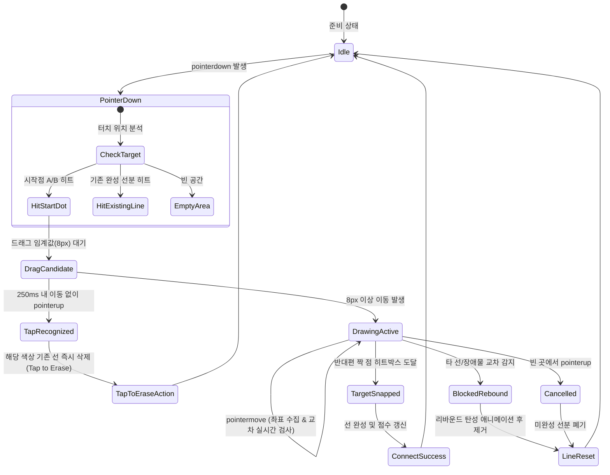
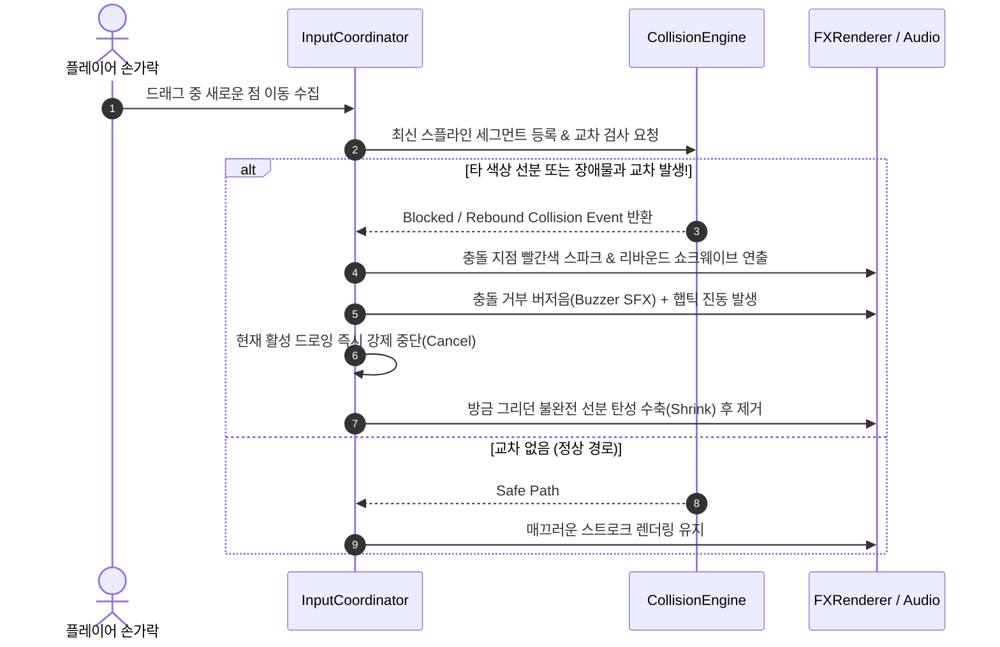
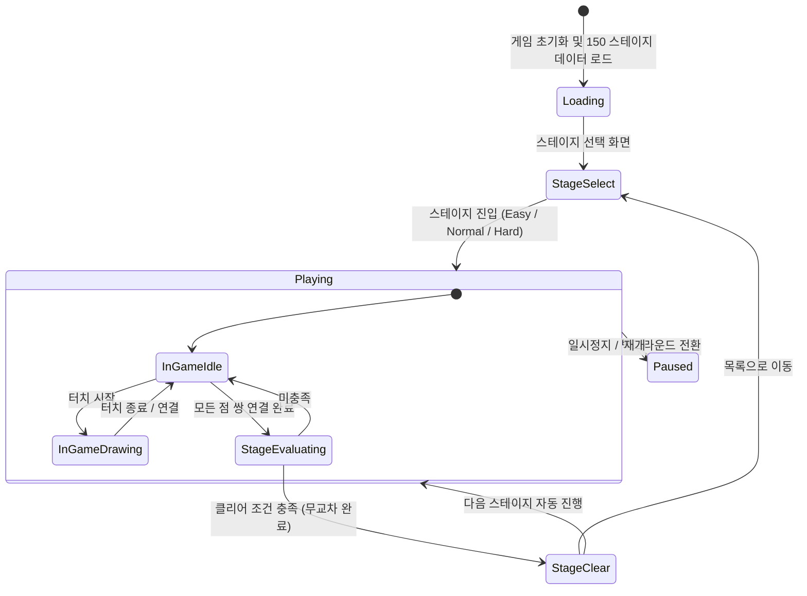

# [Architecture] 자유 곡선 점 잇기 게임 (Connect Dots) 기술 아키텍처 명세서

---

## 1. 시스템 아키텍처 개요 (System Architecture Overview)

본 문서는 **Connect Dots (자유 곡선 점 잇기)** 프로젝트의 고성능 클라이언트 아키텍처, 렌더링 파이프라인, 물리/교차 판정 알고리즘, 오디오 합성 및 150개 스테이지 관리/생성 시스템을 정의합니다.

### 1.1 핵심 기술 스택 명세
- **언어 & 번들러**: **TypeScript 5.x + Vite 5.x** (Zero-latency HMR, 초경량 빌드)
- **렌더링 엔진**: **Multi-layer HTML5 Canvas 2D Context** (GPU 가속 최적화, 60~120 FPS 타깃)
- **입력 파이프라인**: **Unified Pointer Events API** (모바일 멀티터치, 스타일러스 펜, 데스크톱 마우스 단일화)
- **오디오 엔진**: **Web Audio API** (외부 음원 파일 없이 코드 기반 실시간 합성음 + 커스텀 SFX)
- **패키징 & 네이티브 브릿지**: **Capacitor 6.x** (Android WebView 무손실 래핑, 햅틱 진동, 하드웨어 뒤로가기)
- **상태 관리**: **Unidirectional Data Flow + Command Pattern** (Undo/Redo, Snapshot Serializer)

### 1.2 시스템 계층 구조 (Layered Architecture)

```mermaid
flowchart TD
    subgraph Platform_Layer [플랫폼 & 네이티브 래퍼]
        Browser[Modern Web Browser]
        AndroidCapacitor[Android WebView / Capacitor]
        Haptics[Haptics / Native Audio Plugin]
    end

    subgraph Presentation_Layer [표현 계층 - Multi-Layer Canvas & UI]
        BackgroundCanvas[Background / Grid Layer]
        StaticCanvas[Completed Splines Layer]
        ActiveCanvas[Active Dragging Spline Layer]
        FXCanvas[Dots, Hitbox & Particle FX Layer]
        HTMLOverlay[HUD / Star Modal / Control Buttons]
    end

    subgraph Input_Gesture_Layer [입력 & 제스처 계층]
        PointerHandler[Pointer Events Coordinator]
        GestureDetector[Tap / Drag / Rebound Discriminator]
        CoordTransformer[Screen to Normalized (0~1) Coordinate Space]
    end

    subgraph Core_Engine_Layer [핵심 게임 엔진 계층]
        GameFSM[Game State Machine (FSM)]
        LevelManager[Stage & Progress Manager]
        SplineInterpolator[Catmull-Rom Spline Interpolator]
        CollisionEngine[CCW Line Segment Intersection & Spatial Grid]
        ScoreEvaluator[Path Efficiency & 3-Star Evaluator]
        SynthAudioEngine[Web Audio Polyphonic Synthesizer]
    end

    subgraph Data_Layer [데이터 & 영속화 계층]
        LevelData[150 Stages JSON Repository]
        ProceduralGen[Procedural Stage Generator]
        LocalStore[Progress & Star Rating Storage]
    end

    Platform_Layer --> Input_Gesture_Layer
    Input_Gesture_Layer --> Core_Engine_Layer
    Core_Engine_Layer --> Presentation_Layer
    Core_Engine_Layer --> Data_Layer
    Core_Engine_Layer --> Haptics
```

---

## 2. 디렉토리 및 모듈 구조 (Directory & Module Structure)

개발 에이전트가 즉각 구현할 수 있도록 모듈 분리와 단일 책임 원칙(SRP)을 엄격히 준수한 파일 트리를 정의합니다.

```text
connectDots/
├── index.html                   # 엔트리 HTML (Retina Canvas 및 메타태그)
├── package.json                 # 프로젝트 의존성 및 스크립트
├── tsconfig.json                # TypeScript 엄격 모드 설정
├── vite.config.ts               # Vite 빌드 설정
├── capacitor.config.ts          # Android 패키징 설정
├── docs/
│   ├── GDD.md                   # 게임 기획서
│   └── ARCHITECTURE.md          # 본 기술 아키텍처 문서
├── public/
│   ├── favicon.ico
│   └── data/
│       ├── stages_easy.json     # Easy 1~50 스테이지 정적 데이터
│       ├── stages_normal.json   # Normal 1~50 스테이지 정적 데이터
│       └── stages_hard.json     # Hard 1~50 스테이지 정적 데이터
└── src/
    ├── main.ts                  # 부트스트랩 엔트리포인트
    ├── types/
    │   ├── stage.ts             # 스테이지, 점(Dot), 장애물 데이터 타입
    │   ├── geometry.ts          # 점, 벡터, 선분, 스플라인 구조체
    │   ├── game.ts              # 게임 상태, 유저 액션, 평가 결과 타입
    │   └── audio.ts             # 오디오 이벤트 및 주파수 매핑 타입
    ├── core/
    │   ├── GameApp.ts           # 게임 메인 인스턴스 (루프 및 서브시스템 총괄)
    │   ├── GameStateMachine.ts  # FSM (Init -> Select -> Playing -> Clear -> Pause)
    │   ├── CommandManager.ts    # Undo / Redo 커맨드 히스토리 관리
    │   └── ScoreCalculator.ts   # 최단 거리 대비 길이/매끄러움 별점 산출
    ├── render/
    │   ├── CanvasManager.ts     # 다중 레이어 캔버스 크기/DPI 동기화
    │   ├── RenderPipeline.ts    # RAF(RequestAnimationFrame) 메인 렌더 루프
    │   ├── SplineRenderer.ts    # Catmull-Rom 곡선 및 네온/잉크 스트로크 드로잉
    │   ├── DotRenderer.ts       # 점(Dot), 펄스 링, 접속 가이드 렌더러
    │   ├── ObstacleRenderer.ts  # 장애물(원, 사각형, 다각형) 렌더러
    │   └── ParticleSystem.ts    # 클리어 폭죽, 선 삭제/스냅 스파크 파티클
    ├── input/
    │   ├── InputCoordinator.ts  # Pointerdown/move/up/cancel 수신 및 브로드캐스트
    │   ├── GestureRecognizer.ts # Tap-to-Erase vs Drag-to-Draw 판별
    │   └── CoordinateMapper.ts  # CSS 픽셀 <-> HiDPI <-> 0.0~1.0 정규화 좌표 변환
    ├── collision/
    │   ├── IntersectionDetector.ts # CCW 기반 선분 교차 검사 엔진
    │   ├── SpatialHashGrid.ts      # O(N) 최적화를 위한 2D 공간 분할 그리드
    │   ├── ObstacleCollision.ts    # 원/AABB/선분 간 간섭 판정
    │   └── ReboundHandler.ts       # 교차 충돌 시 즉각 차단 및 리바운드 탄성 피드백
    ├── math/
    │   ├── Vector2D.ts          # 2D 벡터 연산 (내적, 외적, 거리, 노멀라이즈)
    │   └── CatmullRom.ts        # Catmull-Rom 스플라인 보간 및 테셀레이션
    ├── audio/
    │   ├── SoundEngine.ts       # Web Audio API 컨텍스트 및 신디사이저
    │   ├── ScaleTuner.ts        # 점 색상별 펜타토닉 음계 매핑
    │   └── SoundEffects.ts      # 드로잉 텍스처 노이즈, 찰칵 스냅음, 클리어 화음
    ├── level/
    │   ├── LevelManager.ts      # 150 스테이지 로드, 로컬 캐시, 힌트 프로바이더
    │   ├── LevelStorage.ts      # LocalStorage 기반 별점, 클리어 기록 영속화
    │   └── generator/
    │       ├── PlanarGraphGen.ts    # 평면 그래프 기반 무교차 경로 생성기
    │       ├── PathCarver.ts        # 스플라인 충돌 회피 패스 카빙
    │       └── LevelValidator.ts    # 생성된 레벨의 솔루션 존재성(Solvability) 검증
    └── ui/
        ├── HUDController.ts     # 상단 스테이지 번호, 별점, Undo/Reset 버튼 바인딩
        ├── ClearModal.ts        # 스테이지 클리어 축하 팝업 및 다음 스테이지 버튼
        └── StageSelectModal.ts  # 3난이도 탭(Easy/Normal/Hard) 50그리드 선택 UI
```

---

## 3. 캔버스 렌더러 파이프라인 (Canvas Rendering Pipeline)

모바일 브라우저 및 안드로이드 웹뷰에서 **흐림 없는 고해상도(Retina)**와 **60+ FPS의 극도로 부드러운 드로잉 경험**을 보장하기 위한 렌더링 파이프라인입니다.

### 3.1 4계층 멀티 레이어 캔버스 구조 (Multi-Layer Strategy)

단일 캔버스에서 매 프레임 모든 요소를 지우고 다시 그리는 방식(`clearRect`)은 선분이 많아질수록 드로우콜 비용이 급증하여 60FPS 유지가 불가능합니다. 본 아키텍처는 DOM 레벨에서 4장의 투명 캔버스를 중첩합니다.

```mermaid
flowchart TD
    subgraph MultiLayer_Canvas [4-Layer 중첩 캔버스 스택]
        L1[Layer 1: bg-canvas - z-index: 10\n배경 도화지 질감, 격자 가이드, 정적 장애물]
        L2[Layer 2: static-canvas - z-index: 20\n이미 성공적으로 연결 완료된 완성 선분들]
        L3[Layer 3: active-canvas - z-index: 30\n현재 손가락으로 드래그 중인 실시간 동적 선분]
        L4[Layer 4: fx-canvas - z-index: 40\n점(Dots), 터치 리플, 펄스, 파티클 이펙트]
    end
    
    UpdateStatic[완성 선 변경 시에만 1회 리드로우] --> L2
    UpdateActive[매 터치 이동마다 60~120fps 즉각 클리어 & 리드로우] --> L3
    UpdateFX[애니메이션 진행 중에만 RAF 갱신] --> L4
```

1. **Layer 1 (Background Canvas)**: 
   - 배경 스케치북 텍스처, 은은한 도트 격자, 장애물(Obstacles)을 렌더링.
   - 스테이지 진입 시 **최초 1회만 렌더링** (Dirty 플래그가 켜지지 않는 한 프레임 갱신 0).
2. **Layer 2 (Static Splines Canvas)**:
   - 플레이어가 이미 연결 완료한 색상의 선분들을 저장.
   - **새로운 선이 완성되거나, 선이 삭제(Tap to Erase / Undo)될 때만 1회 재렌더링**.
3. **Layer 3 (Active Spline Canvas)**:
   - 플레이어가 터치 후 현재 실시간으로 그리고 있는 궤적 전용 캔버스.
   - 드래그 중에만 `requestAnimationFrame`을 통해 해당 레이어만 지우고 갱신. 다른 레이어에 영향을 주지 않으므로 CPU/GPU 부하 극소화.
4. **Layer 4 (FX & Dots Canvas)**:
   - 시작점/끝점 도트, 현재 닿은 지점의 펄스 효과, 파티클 폭죽 렌더링.

### 3.2 Retina / HiDPI (devicePixelRatio) 스케일링 기법

모바일 기기의 디스플레이 스케일(`window.devicePixelRatio`)을 반영하여 캔버스의 내부 버퍼 해상도를 키우고, CSS 스타일 크기로 축소 투영하여 레티나 디스플레이에서도 1픽셀 번짐 없는 날카롭고 선명한 스트로크를 유지합니다.

```typescript
export function setupHiDPICanvas(canvas: HTMLCanvasElement, widthCss: number, heightCss: number): CanvasRenderingContext2D {
  const dpr = Math.min(window.devicePixelRatio || 1, 2.5); // 배터리 및 GPU 고려 상한 2.5
  canvas.width = Math.floor(widthCss * dpr);
  canvas.height = Math.floor(heightCss * dpr);
  canvas.style.width = `${widthCss}px`;
  canvas.style.height = `${heightCss}px`;

  const ctx = canvas.getContext('2d', { alpha: true, desynchronized: true })!;
  ctx.scale(dpr, dpr);
  ctx.lineCap = 'round';
  ctx.lineJoin = 'round';
  return ctx;
}
```

### 3.3 Catmull-Rom 스플라인 보간 및 테셀레이션 알고리즘

입력 터치 이벤트는 기기 주사율에 따라 불연속적인 점(Point)들로 수집됩니다. 이를 단순 직선(`lineTo`)으로 이으면 꺾인 각이 보여 손맛을 해치므로, **Catmull-Rom Spline**을 통해 모든 제어점(Control Points)을 통과하는 부드러운 C1 연속 곡선을 실시간 생성합니다.

#### Catmull-Rom 수식 매개변수화:
4개의 연속된 점 $P_0, P_1, P_2, P_3$와 매개변수 $t \in [0, 1]$에 대해 곡선 위의 점 $C(t)$는:
$$C(t) = 0.5 \times \left( (2 P_1) + (-P_0 + P_2) t + (2 P_0 - 5 P_1 + 4 P_2 - P_3) t^2 + (-P_0 + 3 P_1 - 3 P_2 + P_3) t^3 \right)$$

#### 충돌 검사용 테셀레이션 (Tessellation):
렌더링뿐 아니라 선분 교차 검사를 위해 스플라인 1구간당 4~8개의 세분화된 직선 세그먼트(`LineSegment`)로 분할하여 캐싱합니다.

---

## 4. 입력 제스처 핸들러 (Input & Gesture Pipeline)

모바일 터치와 데스크톱 마우스를 단일 규격인 **Pointer Events API**로 수용하며, 요구사항에 명시된 UX(점 재터치 드로우, 탭하여 지우기, 되돌리기)를 유기적으로 판별합니다.

### 4.1 제스처 상태 머신 (Gesture Recognizer FSM)



### 4.2 기존 선 수정 UX 구현 규격 (요구사항 반영)

1. **점 재터치 후 드래그 시 기존 선 자동 초기화 및 새로 그리기 (Redraw)**:
   - 이미 연결 완료된 색상의 점을 터치한 후 $8\text{px}$ 이상 드래그하면, 기존 연결 선분을 `StaticCanvas`에서 즉시 페이드 제거하고 새로운 활성 드로잉(`ActiveSpline`) 세션을 시작합니다.
2. **점 또는 완성된 선 탭 시 해당 색상 선만 삭제 (Tap to Erase)**:
   - 터치 시작 후 이동 거리가 $8\text{px}$ 미만이고 $250\text{ms}$ 이내에 손을 떼면 **Tap**으로 판정.
   - 터치 좌표가 점 또는 완성된 스플라인 폴리라인의 반경(16px) 내에 있다면, 해당 색상의 선만 '팡' 하는 소멸 파티클과 함께 즉시 캔버스에서 제거됩니다.
3. **하단 Undo(되돌리기) 및 Reset(초기화) 버튼 연동**:
   - 커맨드 패턴(`DrawCommand`)을 채택하여 [되돌리기] 시 직전 완성된 선을 이전 상태로 복구.
   - [초기화] 시 모든 연결을 지우고 캔버스를 초기 배치 상태로 복원.

### 4.3 3단계 좌표 정규화 변환 파이프라인 (Coordinate Normalization)

기기마다 다양한 화면 해상도(태블릿, 스마트폰, 데스크톱)에서 일관된 충돌 판정을 보장하기 위해 모든 내부 연산은 **0.0 ~ 1.0 정규화 공간(Normalized Stage Space)**에서 수행됩니다.

$$\begin{aligned}
\text{Viewport CSS Coord } (x_v, y_v) &\xrightarrow{\text{GetBoundingClientRect}} \text{Canvas Relative Coord } (x_c, y_c) \\
&\xrightarrow{\text{Aspect Ratio Fit}} \text{Normalized Stage Coord } (x_n, y_n) \in [0.0, 1.0]
\end{aligned}$$

---

## 5. 충돌 및 선 교차 판정 엔진 (Collision & Intersection Engine)

선 교차 충돌 요구사항: **[즉각 차단(Rebound / Block)]**  
플레이어가 선을 그리는 실시간(`pointermove`) 과정에서 다른 색상의 기존 선분이나 장애물과 닿는 즉시 궤적을 튕겨내며 그리기를 차단합니다.

### 5.1 CCW(Counter-Clockwise) 벡터 외적 교차 판정 수식

두 선분 $L_1 = \overline{AB}$, $L_2 = \overline{CD}$가 교차하는지 판별하기 위해 2D 외적(Cross Product)을 이용한 CCW 알고리즘을 사용합니다.

$$\text{CCW}(P_1, P_2, P_3) = (P_2.x - P_1.x)(P_3.y - P_1.y) - (P_2.y - P_1.y)(P_3.x - P_1.x)$$

두 선분이 교차할 필요충분조건:
$$\begin{cases}
\text{CCW}(A, B, C) \times \text{CCW}(A, B, D) \le 0 \\
\text{CCW}(C, D, A) \times \text{CCW}(C, D, B) \le 0
\end{cases}$$
*(단, 모든 점이 일직선상에 위치할 경우 바운딩 박스 오버랩 검사 추가)*

```typescript
export function isLineSegmentsIntersecting(
  p1: Point2D, p2: Point2D, p3: Point2D, p4: Point2D
): boolean {
  const ccw = (a: Point2D, b: Point2D, c: Point2D) =>
    (b.x - a.x) * (c.y - a.y) - (b.y - a.y) * (c.x - a.x);

  const cp1 = ccw(p1, p2, p3);
  const cp2 = ccw(p1, p2, p4);
  const cp3 = ccw(p3, p4, p1);
  const cp4 = ccw(p3, p4, p2);

  if (((cp1 > 0 && cp2 < 0) || (cp1 < 0 && cp2 > 0)) &&
      ((cp3 > 0 && cp4 < 0) || (cp3 < 0 && cp4 > 0))) {
    return true;
  }

  // 끝점이 선분 위에 닿은 특수 케이스 처리
  return isPointOnSegment(p3, p1, p2) || isPointOnSegment(p4, p1, p2) ||
         isPointOnSegment(p1, p3, p4) || isPointOnSegment(p2, p3, p4);
}
```

### 5.2 공간 분할 최적화 (Spatial Hash Grid)

스테이지가 복잡해지면 수십 개의 선분 세그먼트가 누적됩니다. 모든 선분 간의 교차를 $O(N^2)$로 검사하면 모바일 기기에서 프레임 드랍이 발생하므로, 캔버스를 $16 \times 16$ 셀의 **Spatial Hash Grid**로 분할하여 해당 선분이 지나는 셀 내의 선분들만 $O(1 \sim K)$로 교차를 검사합니다.

### 5.3 충돌 처리: 즉각 차단(Rebound / Block) 메카닉



---

## 6. 게임 상태 머신 및 클리어 평가 (State Machine & Evaluation)

### 6.1 게임 FSM (Finite State Machine)



### 6.2 클리어 조건 & 3스타(★) 점수 평가 알고리즘

- **클리어 조건 [A안 - 순수 연결 중심]**:
  1. 스테이지에 정의된 모든 점 쌍($N$쌍)이 정확히 $1:1$로 연결 완료되어야 함.
  2. 어떤 선분도 다른 색상의 선분과 교차하지 않아야 함 (교차 수 $= 0$).
  3. 장애물 침범이 $0$이어야 함.
- **별 3개(★) 평가 공식**:
  - 스테이지 메타데이터에 등록된 기준 최적 선 길이 $L_{\text{par}}$와 유저가 그린 총 선 길이 $L_{\text{user}}$를 비교:
  $$\text{Length Ratio } R_L = \frac{L_{\text{user}}}{L_{\text{par}}}$$
  $$\text{Star Rating} = \begin{cases}
  \bigstar\bigstar\bigstar (3\text{ Stars}) & \text{if } R_L \le 1.15 \text{ and } \text{RetryCount} \le 1 \\
  \bigstar\bigstar\quad (2\text{ Stars}) & \text{if } R_L \le 1.35 \\
  \bigstar\qquad\quad (1\text{ Star}) & \text{All connected (기본 클리어)}
  \end{cases}$$

---

## 7. 오디오 엔진 (Web Audio API Synthesizer)

외부 용량 부담과 네트워크 로딩 딜레이를 없애기 위해 브라우저 내장 **Web Audio API 오실레이터(OscillatorNode)**를 사용한 순수 코드 합성 사운드 엔진을 탑재합니다.

### 7.1 사운드 아키텍처 및 노드 라우팅

```mermaid
flowchart LR
    subgraph Sound_Synthesis_Graph
        Osc1[OscillatorNode (Sine/Triangle)] --> Gain1[ADSR Gain Envelope]
        Noise[AudioBufferSource (White Noise)] --> Filter[BiquadFilter (Lowpass)]
        Filter --> Gain2[Friction Gain]
        Gain1 --> MasterGain[Master Volume Gain]
        Gain2 --> MasterGain
        MasterGain --> Destination[AudioContext.destination (Speakers)]
    end
```

### 7.2 색상별 음계 튜닝 매핑 (Pentatonic Major Scale)
선을 연결할 때마다 음악적인 즐거움을 주기 위해 색상 인덱스별로 청명한 펜타토닉(도, 레, 미, 솔, 라, 높은 도...) 화음을 할당합니다:

| 색상 ID | 기본 색상 | 주파수 (Hz) | 음계 | 파형 (Waveform) |
| :--- | :--- | :--- | :--- | :--- |
| `dot_red` | 빨강 (#FF4757) | 523.25 Hz | C5 (도) | Sine + Soft Overdrive |
| `dot_blue` | 파랑 (#1E90FF) | 587.33 Hz | D5 (레) | Sine + Triangle |
| `dot_green` | 초록 (#2ED573) | 659.25 Hz | E5 (미) | Sine + Triangle |
| `dot_yellow` | 주황 (#FFA502) | 783.99 Hz | G5 (솔) | Triangle |
| `dot_purple` | 보라 (#9B59B6) | 880.00 Hz | A5 (라) | Sine + Flute Bell |
| `dot_cyan` | 청록 (#00D2D3) | 1046.50 Hz | C6 (높은 도) | Pure Sine Bell |
| `dot_pink` | 핑크 (#FF6B81) | 1174.66 Hz | D6 (높은 레) | Sine + Shimmer |

- **드로잉 중 효과**: 필터링된 화이트 노이즈로 캔버스 위를 연필/크레파스가 지나가는 사각사각 마찰 텍스처 사운드 구현.
- **충돌 리바운드 효과**: 120Hz 사각파(Square Wave) 100ms 급속 감쇄 버저음.
- **클리어 팡파르**: C5 - E5 - G5 - C6 아르페지오가 $80\text{ms}$ 간격으로 연쇄 발음되며 풍성한 클리어 축하 화음 생성.

---

## 8. 150 스테이지 레벨 시스템 & 절차적 생성기 (Level Pipeline)

게임은 총 3단계 난이도 $\times$ 난이도당 50단계 = **총 150개 스테이지**를 완벽하게 구비합니다.

### 8.1 난이도 매트릭스 정의

```text
[Easy: 1 ~ 50]       3 ~ 4개 점 쌍, 장애물 없음, 넓은 공간 (직관적 연결)
[Normal: 1 ~ 50]     5 ~ 6개 점 쌍, 고정 블록 1~3개 (단순 사각형/원), 우회로 필요
[Hard: 1 ~ 50]       7 ~ 9개 점 쌍, 복합 미로 벽 3~6개, 좁은 병목 구간
```

### 8.2 절차적 레벨 생성 알고리즘 (Procedural Generator Architecture)

레벨 디자이너 없이도 수학적으로 '반드시 풀 수 있는(Solvable)' 150개 스테이지를 자동 생성하고 검증하는 **역방향 스플라인 생성 파이프라인(Reverse Spline Generation Pipeline)**을 설계합니다.

```mermaid
flowchart TD
    StartGen[1. 캔버스 그리드 및 경계 초기화] --> SeedPaths[2. 무작위 점 쌍 생성 & Self-Avoiding Walk 경로 탐색]
    SeedPaths --> SmoothSpline[3. 경로를 부드러운 스플라인으로 보간]
    SmoothSpline --> CheckCross{4. 생성된 경로 간 교차 검사}
    CheckCross -- 교차 발생 --> SeedPaths
    CheckCross -- 무교차 확인 --> CarveObstacle[5. 빈 여백 공간에 장애물(AABB/Circle) 안전 배치]
    CarveObstacle --> ExtractEndpoints[6. 경로의 양 끝점(Point A, Point B)을 스테이지 점으로 추출]
    ExtractEndpoints --> SolveVerify{7. A* / Dijkstra 솔루션 존재성 재검증}
    SolveVerify -- 검증 실패 --> SeedPaths
    SolveVerify -- 검증 통과 --> ExportJSON[8. 150개 스테이지 JSON 빌드 및 Par Length 자동 계산]
```

1. **역방향 경로 생성**: 점을 먼저 찍고 경로를 찾는 것이 아니라, **캔버스 상에 서로 교차하지 않는 $N$개의 유려한 스플라인 경로를 먼저 생성**.
2. **단자점 추출**: 각 스플라인의 시작점과 끝점을 플레이어가 연결해야 할 점 쌍(`pointA`, `pointB`)으로 지정.
3. **최적 길이($L_{\text{par}}$) 도출**: 생성된 무교차 경로의 실제 호의 길이(Arc Length)를 계산하여 스테이지의 별 3개 기준 선 길이로 자동 책정.
4. **장애물 삽입**: 스플라인들이 지나가지 않는 빈 공간(Dead Space)에 볼록 다각형 또는 원형 장애물을 배치하여 우회 경로의 긴장감을 극대화.

---

## 9. 안드로이드 웹뷰 / Capacitor 연동 아키텍처

안드로이드 모바일 기기에서 네이티브 앱과 동일한 퍼포먼스와 조작감을 달성하기 위한 설정 명세입니다.

### 9.1 Capacitor 플러그인 연동
- `@capacitor/haptics`: 선 연결 시 가벼운 진동(Impact Light), 충돌 리바운드 시 묵직한 진동(Notification Error) 전달.
- `@capacitor/status-bar`: 몰입형 풀스크린(Immersive Fullscreen) 적용 및 상단 상태바 숨김/테마색 일치.
- `@capacitor/app`: 안드로이드 물리 [뒤로가기] 버튼 누를 시 (인게임 $\rightarrow$ 스테이지 선택창 $\rightarrow$ 앱 종료) 단계적 라우팅.

### 9.2 안드로이드 웹뷰 성능 최적화 파라미터 (index.html & CSS)
```html
<!-- 더블탭 줌, 핀치 줌, 고무줄 스크롤 완벽 차단 -->
<meta name="viewport" content="width=device-width, initial-scale=1.0, maximum-scale=1.0, user-scalable=no, viewport-fit=cover">
```

```css
/* 캔버스 터치 딜레이 300ms 제거 및 브라우저 제스처 차단 */
body, #game-container, canvas {
  touch-action: none;
  -webkit-touch-callout: none;
  -webkit-user-select: none;
  user-select: none;
  overscroll-behavior: none;
}
```

---

## 10. 핵심 인터페이스 및 타입 명세 (Core TypeScript Definitions)

개발 에이전트가 `src/types/`에 바로 복사하여 타입 세이프한 구현을 진행할 수 있는 핵심 인터페이스 전문입니다.

### 10.1 `src/types/geometry.ts`
```typescript
export interface Point2D {
  x: number;
  y: number;
}

export interface LineSegment {
  p1: Point2D;
  p2: Point2D;
}

export interface RectBounds {
  x: number;
  y: number;
  width: number;
  height: number;
}
```

### 10.2 `src/types/stage.ts`
```typescript
import { Point2D } from './geometry';

export type DifficultyLevel = 'easy' | 'normal' | 'hard';
export type ObstacleType = 'circle' | 'rect' | 'polygon';

export interface DotPair {
  pairId: string;
  color: string;
  colorName: string;
  radius: number; // 0.0 ~ 1.0 정규화 기준 반경 (기본: 0.04)
  pointA: Point2D;
  pointB: Point2D;
}

export interface Obstacle {
  id: string;
  type: ObstacleType;
  x?: number;
  y?: number;
  radius?: number;
  width?: number;
  height?: number;
  vertices?: Point2D[];
}

export interface StageData {
  stageId: string;
  difficulty: DifficultyLevel;
  stageIndex: number;
  canvas: {
    aspectRatio: string; // '1:1'
    theme: string;       // 'sketchbook' | 'grid_paper' | 'dark_slate'
    parLength: number;   // 별 3개 기준 총 선 길이
  };
  dots: DotPair[];
  obstacles: Obstacle[];
  solutionHints?: {
    pairId: string;
    path: Point2D[];
  }[];
}
```

### 10.3 `src/types/game.ts`
```typescript
import { Point2D, LineSegment } from './geometry';
import { StageData } from './stage';

export interface SplinePath {
  pairId: string;
  color: string;
  rawPoints: Point2D[];
  tessellatedSegments: LineSegment[];
  totalLength: number;
  isComplete: boolean;
}

export interface StageEvaluation {
  isCleared: boolean;
  stars: number; // 1, 2, 3
  userTotalLength: number;
  parLength: number;
  efficiencyRatio: number;
}

export type GameState = 'LOADING' | 'STAGE_SELECT' | 'PLAYING' | 'PAUSED' | 'STAGE_CLEAR';
```

---

## 11. 구현 착수 로드맵 (Actionable Implementation Phases)

개발 에이전트는 다음 순서에 따라 단계별로 빌드 및 유닛 테스트를 수행합니다.

1. **1단계: 프로젝트 환경 세팅**
   - Vite + TypeScript + Canvas 셋업, HiDPI 스케일링 및 반응형 컨테이너 구축.
2. **2단계: 수학 & 충돌 엔진 구현**
   - Catmull-Rom 보간기, CCW 선분 교차 검사기, 공간 분할 해시 그리드 유닛 테스트.
3. **3단계: 다중 레이어 렌더러 & 입력 제스처 핸들러 구축**
   - 4-Layer 캔버스, Pointer Events 기반 제스처(Drag, Tap to Erase, Rebound Block) 완성.
4. **4단계: Web Audio 신디사이저 & FX 파티클 결합**
   - 펜타토닉 음계 연주, 사각사각 드로잉 텍스처, 연결 폭죽 파티클.
5. **5단계: 150 스테이지 생성기 및 JSON 로더 완성**
   - 절차적 생성 알고리즘으로 Easy 50, Normal 50, Hard 50 레벨 데이터 생성 및 검증.
6. **6단계: HUD UI, Undo/Reset 커맨드 및 Capacitor 네이티브 연동**
   - 상단 별점/조작 UI, 클리어 팝업, 모바일 햅틱 연동.
