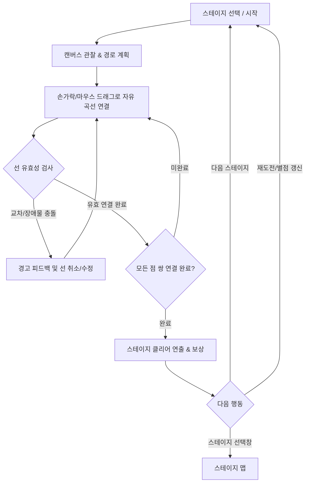

# [GDD] 자유 곡선 점 잇기 게임 (Connect Dots) 기획서

---

## 1. 프로젝트 개요 (Overview)

### 1.1 기본 정보
- **게임명**: Connect Dots (자유 곡선 점 잇기 - 가칭)
- **장르**: 캐주얼 드로잉 퍼즐 (Casual Drawing Puzzle)
- **플랫폼**: 모바일 (iOS / Android 터치 기반) 및 웹/PC (HTML5 Canvas / 마우스 지원)
- **타깃 유저**: 직관적인 퍼즐과 손맛 있는 드로잉 경험을 선호하는 전 연령층 (하이퍼캐주얼 ~ 미드코어 퍼즐 게이머)
- **비주얼 콘셉트**: 
  - 따뜻하고 감성적인 **도화지/캔버스(Sketchbook / Canvas)** 테마
  - 크레파스, 잉크, 형광펜, 네온 라인 등 부드럽고 생동감 있는 스트로크 비주얼
  - 미니멀하고 직관적인 UI/UX

### 1.2 핵심 콘셉트 & 차별화 포인트
- **격자(Grid) 탈피**: 기존 바둑판 격자형 점 잇기(예: Flow Free 계열)의 딱딱한 90도 꺾임에서 벗어나, 캔버스 위에서 손가락(마우스)으로 유려한 자유 곡선(Free-form Spline)을 그려 연결.
- **아날로그 드로잉 감성**: 선의 굵기 변화, 부드러운 스플라인 보정(Catmull-Rom / Bézier), 잉크 번짐 및 발광 효과.
- **공간 지각과 병목(Bottleneck) 퍼즐**: 선의 두께와 캔버스 공간 배분을 고려해 우회로를 설계하는 두뇌 자극 퍼즐.

---

## 2. 코어 게임 루프 (Core Game Loop)



### 루프 단계별 상세
1. **관찰 (Analyze)**: 도화지에 배치된 동일 색상의 점(Dot Pair)들의 위치와 장애물(Obstacle)을 파악하고 최적의 선 경로를 직관적으로 설계.
2. **드로잉 (Draw)**: 점 하나를 터치/클릭한 채 드래그하여 같은 색상의 반대편 점으로 자유 곡선 드로잉.
3. **상호작용 & 실시간 피드백 (Feedback)**: 다른 선에 닿거나 장애물에 걸리면 햅틱/시각 경고 발생. 선을 떼면 올바른 연결 여부 판정.
4. **완성 & 성취 (Reward)**: 모든 색상 쌍이 서로 꼬이지 않고 이어지는 순간 캔버스 전체에 화려한 연결 완료 이펙트 및 별점(★ 1~3개) 부여.

---

## 3. 게임 룰 & 인터랙션 메카닉 (Mechanics & Rules)

### 3.1 자유 곡선 연결 룰 (Drawing & Connection Rules)

1. **시작과 종료**:
   - 연결하려는 색상의 점 A(Dot A) 반경(히트박스) 내부를 터치/클릭하여 드로잉 시작.
   - 드래그 상태를 유지하며 같은 색상의 점 B(Dot B) 반경 내에 도달 후 손을 떼거나 닿으면 연결 성공.
   - 이미 연결된 선이 있는 상태에서 해당 점을 다시 드래그하면 기존 선을 대체하여 새로 그림.

2. **교차 판정 룰 (Intersection Rules)**:
   - **타 색상 선과의 교차**: **절대 불가 (Strictly Prohibited)**.
     - *처리 방식*: 드로잉 도중 다른 색상의 기존 선과 교차하는 순간 빨간색 경고 표시와 함께 즉시 드로잉이 중단되거나, 손을 뗐을 때 무효화되어 이전 상태로 복구(Cancel).
   - **동일 선의 자기 교차 (Self-Intersection / 루프)**:
     - 원칙적으로 **허용하지 않음** (공간 낭비 및 버그 방지). 단, 공간 우회를 위한 헐거운 고리 모양은 교차가 아니면 허용. 선분 간의 교차(Self-intersection) 발생 시 드로잉 실패 처리.

3. **장애물 및 타 오브젝트 간섭 룰**:
   - **다른 색상의 점(Dot) 관통 불가**: 다른 색 점의 중심 기준 일정 반경(Keep-out Zone)을 침범할 수 없음.
   - **장애물(Wall/Obstacle) 통과 불가**: 캔버스 내 배치된 벽/바위/블랙홀 등 장애물의 폴리곤/원형 충돌체 내부로 선을 통과시킬 수 없음.
   - **캔버스 경계(Canvas Bounds) 이탈 불가**: 도화지 외곽 여백 밖으로 선을 그릴 수 없음 (경계 도달 시 좌표 클램핑).

### 3.2 선 지우기 및 다시 그리기 UX (Undo / Erase UX)

- **원터치 삭제 (Tap to Clear)**: 이미 연결된 선 또는 점을 가볍게 탭하면 해당 색상의 선만 깔끔하게 지워짐.
- **덮어쓰기 (Redraw / Overwrite)**: 점을 다시 누르고 드래그를 시작하면 기존 선이 즉시 페이드아웃되며 새 선이 그려짐.
- **되돌리기 (Undo Button)**: 가장 최근에 완성한 선 연결을 1단계 취소.
- **전체 초기화 (Reset Button)**: 캔버스의 모든 선을 일괄 삭제하고 초기 배치 상태로 복원.
- **동적 충돌 처리 옵션 (밀어내기 vs 지우기)**:
  - 사용자가 다른 선을 가로질러 강제로 연결할 경우, 교차된 기존 선을 "자동 끊기(Break)" 처리할지, 아니면 "그리기 차단(Block)"할지 옵션 제공 (기본값: 충돌 시 그리기 차단).

### 3.3 드로잉 보정 및 비주얼 (Feel & Feedback)

- **스무딩 알고리즘**: 초당 60~120fps로 수집된 입력 포인트를 **Catmull-Rom Spline** 또는 **B-Spline**으로 실시간 보간하여 각진 꺾임을 매끄러운 곡선으로 자동 변환.
- **선 두께(Thickness)와 히트박스**:
  - 시각적 선 두께(예: 8px)와 충돌 판정용 두께(예: 12px)를 분리하여 약간의 마진(Grace Margin) 제공 (지나치게 빡빡한 판정으로 인한 스트레스 완화).
- **시각/청각 피드백**:
  - 드로잉 중: 사각사각 연필/마커 소리, 궤적 파티클.
  - 연결 성공 시: 선이 반짝이는 펄스(Pulse) 발광, 경쾌한 실로폰/피아노 음계 사운드 (각 색상마다 고유 음계 매핑: 도-레-미-파-솔...).
  - 전체 클리어 시: 모든 선이 동시에 리드미컬하게 빛나며 폭죽/꽃가루 파티클 연출.

### 3.4 승리 조건 및 성취도 평가 (Victory & Star Rating)

- **클리어 조건**:
  1. 스테이지에 존재하는 모든 점 쌍(Pairs)이 올바르게 1:1로 연결되어야 함.
  2. 선 간의 교차가 0건이어야 함.
  3. 장애물 침범이 0건이어야 함.
- **별 3개 평가 기준 (3-Star System)**:
  - **★ 1개 (Clear)**: 모든 점을 유효하게 연결하여 클리어.
  - **★ 2개 (Efficiency)**: 총 선의 길이가 기준 선 길이(Par Length)의 120% 이내인 경우.
  - **★ 3개 (Perfection)**: 선 수정/재시도 횟수 제한(예: 2회 이내) 및 기준 선 길이 105% 이내로 깔끔하게 완료.

---

## 4. 난이도 시스템 및 150 스테이지 구성 (Difficulty & Progression)

게임은 총 3가지 난이도, 각 난이도당 50스테이지(총 150스테이지)로 구성됩니다.

```
[Easy: 1 ~ 50]   -->  [Normal: 1 ~ 50]  -->  [Hard: 1 ~ 50]
초보자/힐링           중급/공간 퍼즐         고급/극한의 경로 설계
```

### 4.1 난이도별 차별점 정의

| 구분 | Easy (쉬움) | Normal (보통) | Hard (어려움) |
| :--- | :--- | :--- | :--- |
| **스테이지 수** | 50 스테이지 (E01 ~ E50) | 50 스테이지 (N01 ~ N50) | 50 스테이지 (H01 ~ H50) |
| **색상 쌍(Pairs) 수** | 3쌍 ~ 4쌍 | 5쌍 ~ 6쌍 | 7쌍 ~ 9쌍 이상 |
| **장애물 (Obstacles)** | 없음 (0개) | 고정 블록 1~3개 (단순 사각형/원) | 복합 장애물 3~6개 (미로형 벽, 좁은 통로) |
| **캔버스 밀도 / 여유 공간** | 매우 넓음 (여유도 70% 이상) | 중간 (여유도 40~50%) | 빽빽함 (병목 구간 다수, 여유도 20~30%) |
| **경로 간섭도** | 직선/완만한 곡선으로 해결 가능 | 우회 경로(Detour) 필수 설계 | 선들이 서로를 둘러싸는 나선형/복합 래핑 필요 |
| **선 두께(기본)** | 두꺼움 (터치 조작 편의) | 표준 두께 | 세밀한 조작을 요하는 얇은 두께 |
| **힌트 제공** | 기본 무제한 or 풍부 제공 | 스테이지당 1~2회 제공 | 광고 시청 or 재화 소모 |

### 4.2 난이도 곡선 설계 (Progression Curve)

난이도는 단순 선형 증가가 아닌, 피로도를 낮추고 성취감을 극대화하는 **톱니형(Sawtooth) 계단식 난이도 곡선**을 적용합니다.

- **1~5 스테이지**: 룰 학습 및 직관적 해결 (튜토리얼 성격)
- **6~15 스테이지**: 기본 패턴 숙달 (점 점진적 증가)
- **16~20 스테이지**: 1차 허들 (첫 난관 스테이지 배치)
- **21~25 스테이지**: 릴랙스(쉬운 스테이지) 후 새 기믹/장애물 도입
- **26~45 스테이지**: 고도화된 공간 퍼즐 (우회 경로 강제)
- **46~50 스테이지**: 난이도 최종 보스급 종합 문제 (정밀 드로잉 요구)

### 4.3 힌트 시스템 (Hint System)
- **힌트 작동 방식**:
  - 플레이어가 막혔을 때 [힌트] 버튼을 누르면, 아직 연결되지 않은 색상 중 1개를 선택하여 해당 색상의 **이상적인 정답 경로를 반투명 가이드 점선(Ghost Spline)으로 캔버스에 5초간 투영**.
  - 플레이어는 가이드라인을 따라 그리거나, 힌트 선이 자동으로 완성되도록 지원.

---

## 5. 스테이지 레벨 JSON 데이터 스키마 (Stage Data Schema)

다양한 해상도(스마트폰, 태블릿, PC 브라우저)에 대응하기 위해 모든 좌표는 **0.0 ~ 1.0 사이의 정규화된 비율 좌표(Normalized Float Coordinates)**를 사용합니다.

### 5.1 JSON 스키마 정의

```json
{
  "$schema": "http://json-schema.org/draft-07/schema#",
  "title": "ConnectDotsStage",
  "type": "object",
  "required": ["stageId", "difficulty", "stageIndex", "canvas", "dots", "obstacles"],
  "properties": {
    "stageId": { "type": "string", "description": "스테이지 고유 ID (예: easy_001)" },
    "difficulty": { "type": "string", "enum": ["easy", "normal", "hard"] },
    "stageIndex": { "type": "integer", "minimum": 1, "maximum": 50 },
    "canvas": {
      "type": "object",
      "properties": {
        "aspectRatio": { "type": "string", "default": "1:1", "description": "권장 종횡비 (1:1, 4:3, 16:9 등)" },
        "theme": { "type": "string", "description": "캔버스 테마 (sketchbook, grid_paper, dark_slate 등)" },
        "parLength": { "type": "number", "description": "별 3점 기준 최적 총 선 길이 (정규화 단위)" }
      },
      "required": ["aspectRatio", "theme"]
    },
    "dots": {
      "type": "array",
      "description": "연결해야 하는 점 쌍 목록",
      "items": {
        "type": "object",
        "required": ["pairId", "color", "pointA", "pointB"],
        "properties": {
          "pairId": { "type": "string", "description": "색상 쌍 식별자" },
          "color": { "type": "string", "description": "HEX 색상 코드 (예: #FF4757)" },
          "colorName": { "type": "string", "description": "색상 이름 (접근성 및 디버그용)" },
          "radius": { "type": "number", "default": 0.04, "description": "정규화 기준 점 반경 (0.0~1.0)" },
          "pointA": {
            "type": "object",
            "required": ["x", "y"],
            "properties": {
              "x": { "type": "number", "minimum": 0.0, "maximum": 1.0 },
              "y": { "type": "number", "minimum": 0.0, "maximum": 1.0 }
            }
          },
          "pointB": {
            "type": "object",
            "required": ["x", "y"],
            "properties": {
              "x": { "type": "number", "minimum": 0.0, "maximum": 1.0 },
              "y": { "type": "number", "minimum": 0.0, "maximum": 1.0 }
            }
          }
        }
      }
    },
    "obstacles": {
      "type": "array",
      "description": "통과 불가 장애물 목록",
      "items": {
        "type": "object",
        "required": ["id", "type"],
        "properties": {
          "id": { "type": "string" },
          "type": { "type": "string", "enum": ["circle", "rect", "polygon"] },
          "x": { "type": "number", "description": "중심 x (circle/rect)" },
          "y": { "type": "number", "description": "중심 y (circle/rect)" },
          "radius": { "type": "number", "description": "원형 반경" },
          "width": { "type": "number", "description": "직사각형 너비" },
          "height": { "type": "number", "description": "직사각형 높이" },
          "vertices": {
            "type": "array",
            "description": "다각형 정점 목록 [{x, y}]",
            "items": {
              "type": "object",
              "properties": {
                "x": { "type": "number" },
                "y": { "type": "number" }
              }
            }
          }
        }
      }
    },
    "solutionHints": {
      "type": "array",
      "description": "힌트 제공용 정답 스플라인 제어점 목록 (선택)",
      "items": {
        "type": "object",
        "properties": {
          "pairId": { "type": "string" },
          "path": {
            "type": "array",
            "items": {
              "type": "object",
              "properties": {
                "x": { "type": "number" },
                "y": { "type": "number" }
              }
            }
          }
        }
      }
    }
  }
}
```

### 5.2 예시 데이터 1: 초급 스테이지 (Easy 1단계)

```json
{
  "stageId": "easy_001",
  "difficulty": "easy",
  "stageIndex": 1,
  "canvas": {
    "aspectRatio": "1:1",
    "theme": "sketchbook",
    "parLength": 1.25
  },
  "dots": [
    {
      "pairId": "red",
      "color": "#FF4757",
      "colorName": "Red",
      "radius": 0.05,
      "pointA": { "x": 0.2, "y": 0.2 },
      "pointB": { "x": 0.8, "y": 0.2 }
    },
    {
      "pairId": "blue",
      "color": "#2ED573",
      "colorName": "Green",
      "radius": 0.05,
      "pointA": { "x": 0.2, "y": 0.5 },
      "pointB": { "x": 0.8, "y": 0.5 }
    },
    {
      "pairId": "yellow",
      "color": "#FFA502",
      "colorName": "Orange",
      "radius": 0.05,
      "pointA": { "x": 0.2, "y": 0.8 },
      "pointB": { "x": 0.8, "y": 0.8 }
    }
  ],
  "obstacles": []
}
```

### 5.3 예시 데이터 2: 고급 스테이지 (Hard 25단계 - 중앙 장애물 및 좁은 통로)

```json
{
  "stageId": "hard_025",
  "difficulty": "hard",
  "stageIndex": 25,
  "canvas": {
    "aspectRatio": "1:1",
    "theme": "grid_paper",
    "parLength": 4.85
  },
  "dots": [
    {
      "pairId": "red",
      "color": "#FF4757",
      "colorName": "Red",
      "radius": 0.035,
      "pointA": { "x": 0.15, "y": 0.15 },
      "pointB": { "x": 0.85, "y": 0.85 }
    },
    {
      "pairId": "blue",
      "color": "#1E90FF",
      "colorName": "Blue",
      "radius": 0.035,
      "pointA": { "x": 0.85, "y": 0.15 },
      "pointB": { "x": 0.15, "y": 0.85 }
    },
    {
      "pairId": "green",
      "color": "#2ED573",
      "colorName": "Green",
      "radius": 0.035,
      "pointA": { "x": 0.5, "y": 0.1 },
      "pointB": { "x": 0.5, "y": 0.9 }
    },
    {
      "pairId": "yellow",
      "color": "#FFA502",
      "colorName": "Orange",
      "radius": 0.035,
      "pointA": { "x": 0.1, "y": 0.5 },
      "pointB": { "x": 0.9, "y": 0.5 }
    },
    {
      "pairId": "purple",
      "color": "#9B59B6",
      "colorName": "Purple",
      "radius": 0.035,
      "pointA": { "x": 0.3, "y": 0.25 },
      "pointB": { "x": 0.7, "y": 0.75 }
    },
    {
      "pairId": "cyan",
      "color": "#00D2D3",
      "colorName": "Cyan",
      "radius": 0.035,
      "pointA": { "x": 0.25, "y": 0.7 },
      "pointB": { "x": 0.75, "y": 0.3 }
    },
    {
      "pairId": "pink",
      "color": "#FF6B81",
      "colorName": "Pink",
      "radius": 0.035,
      "pointA": { "x": 0.4, "y": 0.35 },
      "pointB": { "x": 0.6, "y": 0.65 }
    }
  ],
  "obstacles": [
    {
      "id": "center_block",
      "type": "circle",
      "x": 0.5,
      "y": 0.5,
      "radius": 0.12
    },
    {
      "id": "top_wall",
      "type": "rect",
      "x": 0.5,
      "y": 0.25,
      "width": 0.25,
      "height": 0.03
    },
    {
      "id": "bottom_wall",
      "type": "rect",
      "x": 0.5,
      "y": 0.75,
      "width": 0.25,
      "height": 0.03
    }
  ]
}
```

---

## 6. 핵심 협의 사항 3가지 (Key Decision Points)

본 게임 메카닉을 완성도 높게 구현하기 위해 사용자와 협의하여 확정해야 할 핵심 기획 의사결정 3가지입니다.

### [협의 1] 선 교차(충돌) 시의 인터랙션 처리 방식
- **배경**: 자유 곡선을 그리다가 이미 연결되어 있는 다른 색상의 선이나 장애물에 닿았을 때 플레이어 경험을 어떻게 가져갈 것인가?
- **선택지**:
  - **A안 (즉각 차단 / Rebound & Cancel)**: 다른 선에 닿는 순간 즉시 진동/경고와 함께 드로잉이 중단되고 손을 뗐을 때 해당 선 전체가 취소됨. (가장 명확하고 실수 방지)
  - **B안 (유연한 통과 후 릴리즈 시 무효화)**: 자유롭게 교차하여 그릴 수는 있으나, 교차 상태로 완료 시 빨간색 충돌 마크가 뜨고 클리어되지 않음. (조작 자유도는 높으나 시각적 피로도 증가)
  - **C안 (밀어내기 / 선 끊기 - Break Prior Line)**: 새 선이 지나갈 때 기존에 연결되어 있던 다른 선을 자동으로 끊어버림(지워버림). (Flow Free 게임 스타일, 빠른 템포)
- **추천**: **A안 또는 C안**. 모바일 터치 환경에서는 의도치 않은 절단 스트레스를 줄이기 위해 기본은 **A안(선 차단)**을 권장.

---

### [협의 2] 선의 두께와 "공간 채우기(Board Coverage)" 룰 도입 여부
- **배경**: 전통적인 격자형 점 잇기는 '모든 칸을 채워야 100% 클리어(Perfect)'가 되는 룰이 존재합니다. 자유 곡선 캔버스에서는 이를 어떻게 취급할 것인가?
- **선택지**:
  - **A안 (순수 연결 중심 퍼즐 - 권장)**: 도화지를 꽉 채울 필요 없이, 서로 얽히지 않고 모든 점 쌍을 1:1로 잇기만 하면 클리어. 대신 '선의 최단 경로(최소 길이)'로 별 3개 평가.
  - **B안 (도화지 면적 채우기율 도입)**: 선의 두께를 브러시처럼 취급하여 도화지 면적의 N% 이상을 색칠하듯 메워야 클리어.
  - **C안 (선 길이 상한선 제한)**: 잉크 게이지(Ink Gauge)를 두어, 총 그릴 수 있는 선의 길이에 제한을 둠 (너무 멀리 돌아가지 못하게 제약).
- **추천**: **A안(순수 연결 + 최단 선 길이 평가)**. B안은 자유 곡선 퍼즐의 쾌적함을 떨어뜨리고 지저분한 지그재그 칠하기를 강제하므로 비권장.

---

### [협의 3] 150 스테이지의 레벨 생성 파이프라인 (절차적 생성 vs 핸드메이드)
- **배경**: 총 150단계(Easy 50, Normal 50, Hard 50) 및 추후 무한 확장을 고려할 때 레벨을 어떻게 제작/수급할 것인가?
- **선택지**:
  - **A안 (절차적 알고리즘 생성기 개발)**: 수학적 평면 그래프(Planar Graph) 알고리즘을 사용해 교차 없는 해(Hamiltonian Path / Non-crossing Splines)를 역으로 생성하고 점과 장애물을 자동 배치하는 생성 스크립트 제작.
  - **B안 (인게임 웹 레벨 에디터 개발 + 수동 큐레이션)**: 기획자가 브라우저에서 마우스로 점과 장애물을 배치하고 바로 플레이 테스트하여 JSON으로 익스포트하는 Level Editor 툴 제작.
  - **C안 (하이브리드)**: 50~100개 핵심 스테이지는 에디터로 정교하게 레벨 디자인하고, 대량 스테이지 및 확장팩은 절차적 알고리즘으로 베이스 생성 후 검증.
- **추천**: **C안 (하이브리드 방식)**. 퍼즐의 퀄리티와 "아하! 모먼트(Aha Moment)"를 보장하기 위해 초반/시그니처 스테이지는 에디터 툴을 통한 정밀 튜닝이 필수적입니다.
